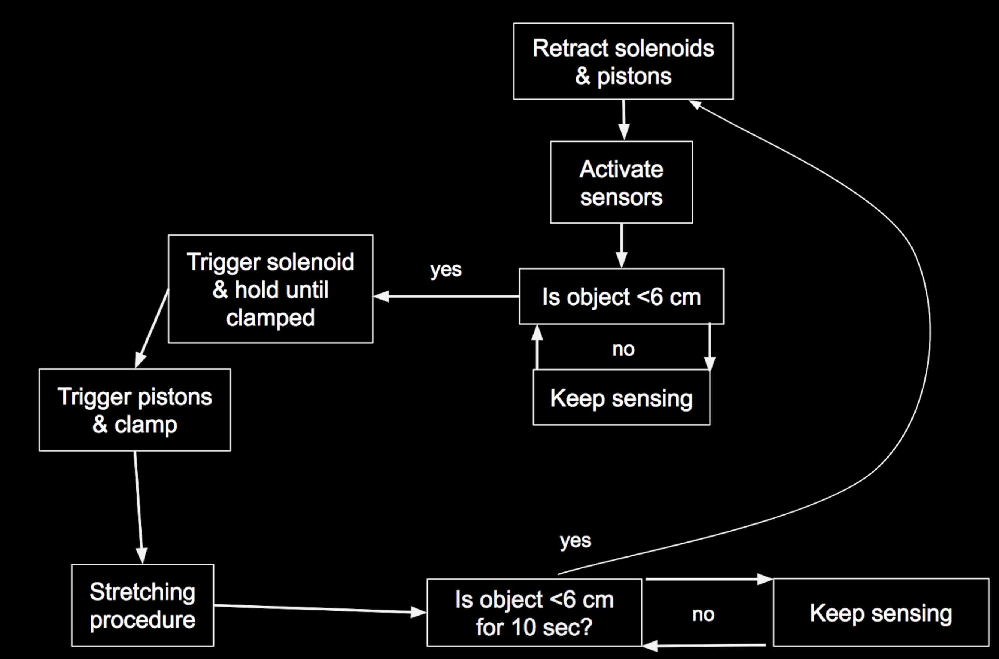

# Research Automation Stage Redesign
This is the code portion for the research automation project by Dr. John Finan. For a full report on his work, visit https://www.jove.com/pdf/57305/jove-protocol-57305-method-for-high-speed-stretch-injury-human-induced-pluripotent-stem

 See final.py for final code & code explanation

 See https://docs.google.com/document/d/1tyzGtYq4kWMPX398z9ARpwwB-9m6vzB-E2wSU4SHoPk/edit for documentation on the circuitry

 See the following figure for the code logic

